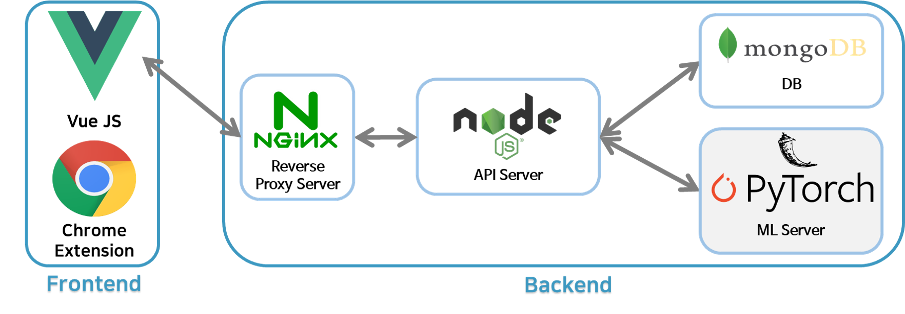

## FindU Read Me

    

<h4 align="center">스크립트 기반 영상 검색 및 요약 서비스</h4>

     
    
    	
    
    
    
      
    
    
    
    

  <a href="#tutorial">Tutorial</a></a> • 
  <a href="#homepage-feature">Homepage Features</a> •  
  <a href="#findu-feature">FindU Features</a> •  
  <a href="#system-structure">System Structures</a> • 
  <a href="#contributor">Contributors</a> • 
  <a href="#license">License</a>

    이 프로젝트는 2021 Ajou University Spring SW capston design 과목의 일환으로 진행되었습니다.  
    이 어플리케이션은 상업적인 목적이 포함되어 있지 않습니다. 
    이 프로젝트는 팀 APC에 의해 개발되었습니다. 
    해당 레포는 찾아봐유의 홈페이지 소스코드를 저장하고 있습니다.     

## Tutorial

1. 크롬 익스텐션에서 앱을 다운로드 받는다. [다운로드 링크](https://github.com/SWCapstone2021/chrome-extension/archive/refs/tags/v0.9.zip)
2. 찾아봐유 크롬 익스텐션을 실행 후 [로그인](https://apcfindu.web.app/) 한다. 
3. [유튜브](https://www.youtube.com) 에서 동영상을 검색 한다.
4. 시청할 동영상을 선택한다.
5. 동영상을 즐겁게 감상 한다.
6. 만약, 찾고 싶은 단어나 문장이 있다면 동영상 내 검색 기능을 활용해서 검색한다.

## Homepage Feature

홈페이지에서는 다음과 같은 기능을 제공 합니다.

- [x] 프로젝트 소개
- [x] 시스템 이용을 위한 가입 및 구독
- [x] 사용자 정보 관리 
- [x] 결제 정보 관리

    <h5>1. 프로젝트 소개 및 구독</h5>
    
	<h5>2. 결제 방법 관리</h5>
    
	<h5>3. 유저 관리</h5>
    

## FindU Feature

    <h5>1. CTRL+F 기능</h5>
    
	<h5>2. QA 기능</h5>
    
	<h5>3. 신뢰도 기능</h5>
    
	<h5>4. 요약 기능</h5>
    

## System Structure

## Contributor

Maintainer : 강한결

Contributor : 김수연, 남희수, 오승민, 허범수

## License

MIT License
