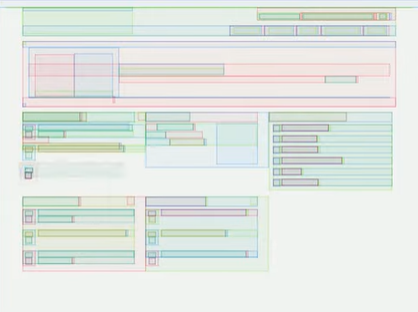

## 브라우저의 동작 과정

교수님께서 프론트앤드의 동작 과정에 대해서 설명해주신 [문서](https://wormwlrm.github.io/2021/03/27/How-browsers-work.html?fbclid=IwAR0KZkQtJHGH26vyet_ToGs62tWFU0pHmwr_7G_ix5KA8fAt3kHd3Ux_W4o)를 참고했다.

중요한 점을 정리하면 4개이다.

1. HTML로 부터 DOM 트리를 CSS로 부터 CSSOM 트리를 만든다.
2. DOM 트리와 CSSOM 트리로 부터 렌더 트리를 만든다.
3. 렌더 트리의 레이아웃을 실행시켜 기하학적 형태를 계산한다. (?)
4. 개별 노드를 화면에 그린다.


이 문서에서 배우는 순서에 따라서 정리하면 다음과 같다.

1. 브라우저의 구조
2. 렌더링 엔진
3. Critical Path (**parsing**, dom tree, **layout**, paint)
4. Virtual Dom


### 브라우저의 구조


- User Interface : 우리가 보는 브라우저의 UI를 가리킨다. 새로고침, 주소창, 북마크 같은 모든 기능이 UI에 해당한다.
- Browser engine: UI와 Rendering Engine 사이의 중재자 역활을 한다. 사용자가 UI를 건드려 명령을 보내면 이 명령을 해석해서 Rendering 엔지에 전달하는 역활을 주로 한다.
- Rendering Engine : HTML, CSS를 파싱해서 이를 브라우저에 그려내는 역활을 한다. 브라우저 마다 다른 렌더링 엔진을 사용하는데 크롬, 엣지, 오페라는 Blink, Firefox는 Gecko, Safari는 Webkit을 사용한다.
- Networking: 웹 서버에 정보를 요청하는 역활을 한다.
- Javascript Interpreter: 자바스크립트를 해석하고 명령을 수행하는 역활을 한다. 크롬의 V8 엔진이 유명하다.
- UI Backend : UI중 사용자의 운영체제에 종속적인 것들을 처리하는 역활을 한다.
- Data Persistence : indexed DB, cookie 등을 관리하는 역활을 한다.


### 렌더링 엔진의 동작 과정


Critical Rendering Path

1. Parsing
2. Render Tree
3. Layout
4. Paint

각 과정에서 리소스를 로드하는 순서나 스크립트의 내용에 따라서 웹페이지의 반응 속도가 달라질 수 있다. 즉, 프론트엔드 개발자라면 렌더링에 걸리는 시간을 계산하고, 사용자 경험을 방해하지 않아야 한다.


### 파싱

- HTML 파싱 : Parse Tree -> Dom Tree (Parse Tree != Dom Tree)
  - HTML 파서의 특징 : Forvining nature , 파싱이 중단 될 수 있다.(파싱 중간에 Script, link가 있다면 그 파일을 받고 해석하고 실행한다.), 재시작(Reentrant) 할 수 있다. (파싱 하는데 Dom이 변경되는 경우)'
- CSS 파싱 : CSS Object Model (CSSOM)


### 렌더 트리

렌더 트리는 DOM, CSSOM 트리를 조합해서 화면에 어떤것이 보이는지 결정해서 보이는 것만 포함하는 트리이다.


### 레이아웃 또는 리플로우



렌더 드리에서 계산되지 않았던 노드들의 크기와 위치, 레이어 간 순서와 같은 정보를 계산하여 좌표에 나타낸다.

레이아웃은 계산 범위에 따라서 전영적 레이아웃, 증분적 레이아웃으로 구분할 수 있다.

- 전역적 레이아웃 : 화면 전체를 다시 계산한다
- 증분적 레이아웃 : 화면이 일부만 수정이 필요할 경우 비동기적으로 이를 계산해서 일부만 다시 계산한다. (Dirty bit system을 활용)

프로그래머가 주의 해야 할점은 증분적 레이아웃이다. 증분적 레이아웃은 비동기적으로 작업을 수행하기 때문에 DOM 객체를 바꾸는 작업이 필요하다면 한번에 하는 것이 좋다. 안그럴 경우 한번에 할 일을 두번에 나눠서 하게 될 수도 있다.

```javascript
// do no recommend this
const divWidth = div1.clientWidth;
div2.style.width = `${diwWidth}px`;

const divHeight = div1.clientHeight;
div2.style.height = `${divHeight}px`;

// should be like this
const divWidth = div1.clientWidth;
const divHeight = div1.clientHeight;

div2.style.width = `${diwWidth}px`;
div2.style.height = `${divHeight}px`;
```


### 페인팅

화면에 엘리먼트를 그리는 과정. 스타일이 복잡할 수록  페인팅 시간이 오래 걸리게 된다. 즉, 불필요한 스타일은 최대한 없애는게 좋다.

### 가상돔

등장 배경 : Critical Path는 60초 정도 주기로 계산이 수행된다. 이 렌더링 경로에서 가장 시간이 오래 걸리는 단계는 레이아웃 단계와 페인팅 단계이다. 따라서 성능 최적화를 위해서는 위 두 단계의 연산 시간을 줄이는 것이 중요하다. 

문제점 : Dom 오브젝트 10개를 for문으로 수정하는 자바스크립트 코드가 있다고 하자. 여기서 문제는 10개가 한번에 수정되면 좋은데 그렇지 않고 총 10번의 렌더링이 수행될 수 있다는 것이다. 이 문제를 해결하고자 가상 돔이 출현했다.

솔루션 : 메모리에 Dom의 구조를 반영한 가상의 돔을 만들고 가상 돔에 변경사항을 저장한 뒤에 변경사항을 Dom에 한번에 반영하자. 이렇게 한번에 반영하면 한번에 걸리는 렌더링 시간은 오래 걸리겠지만 렌더링 횟수가 줄기 때문에 전체적인 연산의 횟수는 최소화 될 수 있다. 이 가상 돔을 사용하는 대표적인 프레임워크가 바로 React, Vue이다.

