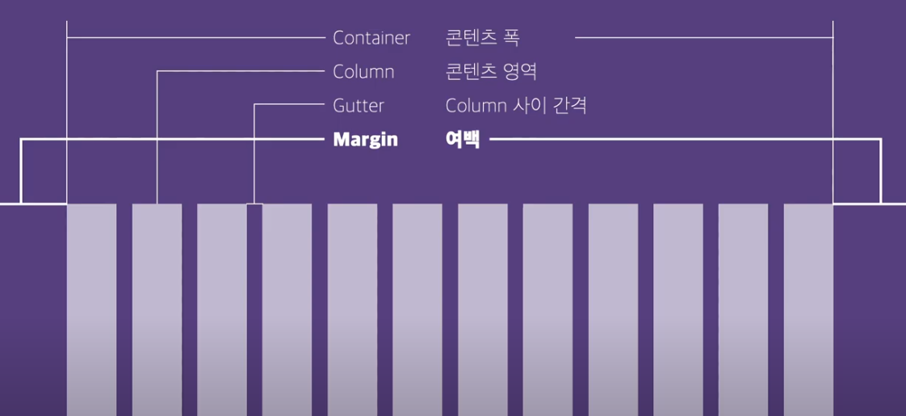
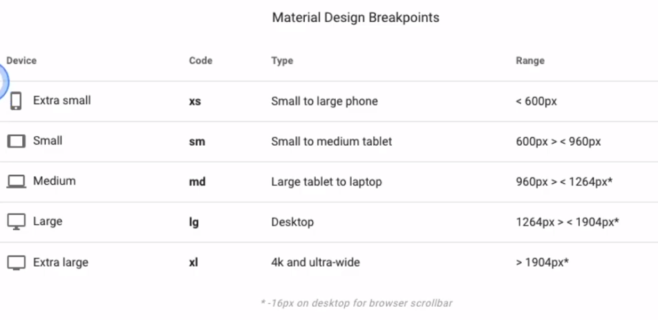

1. GridView (Material Design)

2. Vuetify Grid System

   - FlexBox

   - 12 columns

   - 5가지의 브레이크포인트 : 반응형 UI 디자인을 위한 브레이크포인트

     

   - FlexBox

     - display : inline, block, inline-block
     - Flex ([CSS Flex 완벽 가이드](https://heropy.blog/2018/11/24/css-flexible-box/))
       - [ ] Flex Container : display, flex-flow(flex-direction, flex-wrap), justify-content, align-content, align-items
       - [ ] Flex Items: order, flex(flex-grow, flex-shrink, flex-basis), align-self

3. v-container

   [공식 문서](https://vuetifyjs.com/en/components/grids/#breakpoint-sizing) 참고

   - [ ] v-container
   - [ ] v-row : dense, no-gutters, align
   - [ ] v-col : align-self
   - [ ] v-card
   - [ ] v-spacer
   - [ ] 각 속성
     - [ ] dense, no-gutters
     - [ ] align (parent)
     - [ ] align-self (child)
     - [ ] cols, sm, md, lg (both)

4. v-dialog

   - [ ] vuetify-dialog

   - [ ] $vuetify.breakpoint.xs
   - [ ] $vuetify.breakpoint.sm
   - [ ] $vuetify.breakpoint.md
   - [ ] $vuetify.breakpoint.lg
   - [ ] $vuetify.breakpoint.mobile
   - [ ] $vuetify.breakpoint.name
   - [ ] $vuetify.breakpoint.height
   - [ ] $vuetify.breakpoint.width

5. Typography

   - [ ] text-h1
   - [ ] text-h2
   - [ ] text-h3
   - [ ] text-sm-subtitle-1
   - [ ] text-justify
   - [ ] font-weight-thin

6. colors

   - [ ] primary--text
   - [ ] secondary
   - [ ] lighten-1, darken-1

7. Helper Classes

   Vuetify 의 Helper Class를 사용할 것!

8. 예제

   - [ ] Navigation -> Theme 적용법, Image 적용법, Background 적용법
   - [ ] Table
   - [ ] Button
   - [ ] Icon
   - [ ] forms
   - [ ] SparkLine

9. 색깔을 정하는 방법

   [마터리얼 디자인](https://material.io/design/color/the-color-system.html#tools-for-picking-colors) 공식 가이드 참고

   